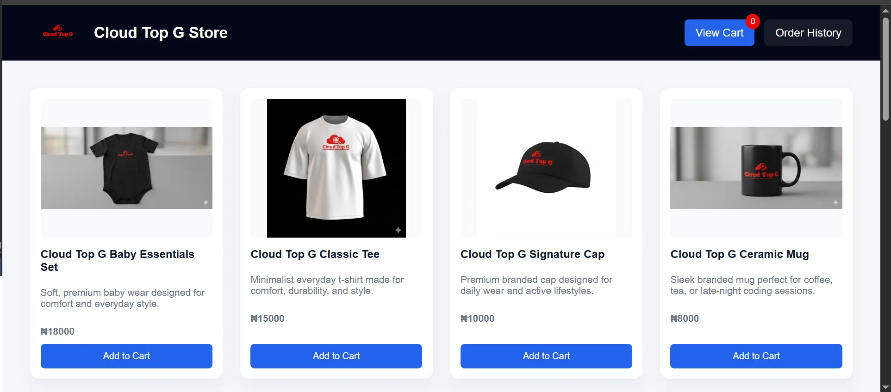
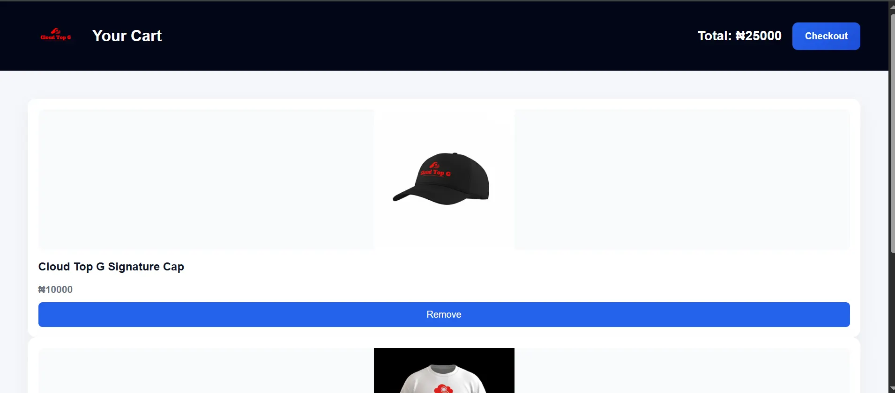
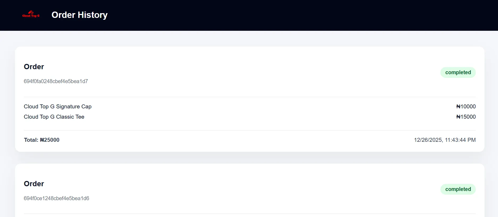

# 🐳 Cloud Top G Store – Docker Microservices Project

Cloud Top G Store is a full microservices-based e-commerce application built using **Docker** and **Docker Compose**.  
The project simulates a real-world production architecture with multiple independent services.

---

## 📸 Application Screenshots



<p align="center">
  
  
</p>

---

## 🧱 Architecture Overview

The system consists of **five independent services**, each running in its own container:

- **Frontend (Store UI)** – Nginx
- **Cart Service** – Node.js (temporary cart data)
- **Order Service** – Node.js (permanent orders)
- **MongoDB** – Persistent database
- **Mongo Express** – Database GUI

All services communicate over a Docker network managed by Docker Compose.

---

## 🔄 Application Flow

1. Users browse products on the frontend
2. Products are added to the cart service
3. Cart data is stored temporarily
4. On checkout:
   - Order service creates a permanent order
   - Cart is cleared
5. Orders are stored in MongoDB
6. Users can view order history at any time

> **Carts are temporary. Orders are permanent.**

---

## 🚀 How to Run the Project

### Prerequisites
- Docker
- Docker Compose

### Run the application
```bash
docker compose up

